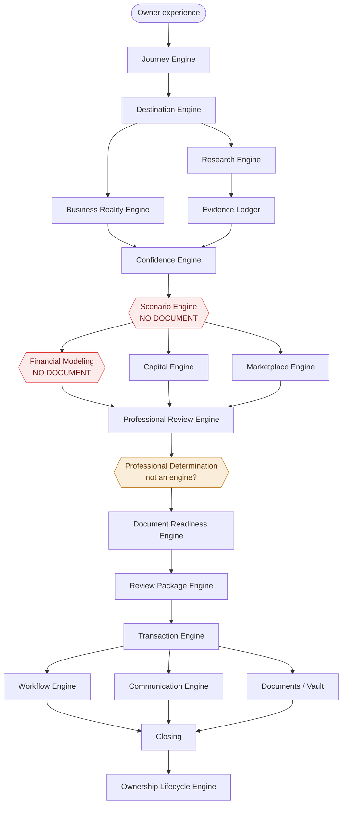
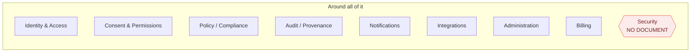
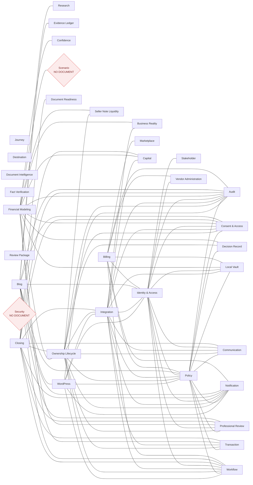

# End-to-end gap analysis

* generated: 2026-09-19 16:19:45 -0700

Generated by `scripts/doc-graph.py` — a dependency graph for the design
bible. Every `.md` file is a node; the edges come from the corpus's real
edge syntax (boundary tables, the section-20 flow diagram, the
infrastructure ring, and explicit links).

Superseded versions are kept in `analysis/archive/`. A `pre-commit`
hook regenerates this report, so it always describes the tree you are
committing.

## Corpus at a glance

* documents on disk: **53** (51 content + README + index)
* DOCUMENT-INDEX entries: **51**
* README group-table total: **51**
* engine keys in the declared architecture: **35**
* engine keys with a backing document: **33**
* docs carrying a boundary table: **9**
* boundary edges extracted: **100**
* explicit markdown links between docs: **61**

---

## Findings

| # | Check | Count | Severity |
| --- | --- | --- | --- |
| 1 | Dangling engines — declared, no document | 2 | High |
| 2 | Engine docs with no boundary section | 13 | High |
| 3 | Structural ambiguity | 5 | Medium |
| 4 | Boundary in prose, not machine-readable | 8 | Medium |
| 5 | Engines no boundary table mentions | 5 | Medium |
| 6 | Naming drift | 2 | Low |
| 7 | Orphan documents | 0 | Low |
| 8 | Layer violations | 0 | Low |
| 9 | Coverage and count mismatches | 0 | Low |

## 1. Dangling engines — declared in the architecture, no document

* Scenario
* Security

## 2. Engine docs with no boundary section at all

* Business Reality Engine v1.0 - Current State Business Assessment.md
* Capital - Financing Engine v1.0.md
* Destination Engine v1.0.md
* Document Readiness & Checklist Engine v1.0.md
* Expanded Reality Architecture - Document Intelligence and Fact Verification.md
* Goal-to-Reality Confidence Research Engine.md
* Journey Builder Architecture & Employee Ownership Journey.md
* Marketplace Engine v1.0.md
* Professional Review Engine v1.0.md
* Professional Review Package Engine v1.0.md
* Seller-Note Liquidity Engine v1.0.md
* Stakeholder Document & Visibility Architecture.md
* Vendor Administration - Vetting Engine v1.0.md

## 3. Structural ambiguity

* Document Intelligence, Fact Verification -> one document (Expanded Reality Architecture - Document Intelligence and Fact Verification.md)
* Confidence, Evidence Ledger, Research -> one document (Goal-to-Reality Confidence Research Engine.md)
* Professional Determination is a node in the section-20 flow diagram, between Professional Review and Document Readiness, but it is not listed as an engine in any layer roster
* Stakeholder maps to 'Stakeholder Document & Visibility Architecture.md', but that document is about document visibility; section 7 describes a Stakeholder / Relationship engine that owns who participates and why
* Journey maps to 'Journey Builder Architecture & Employee Ownership Journey.md' out of three candidate journey documents

## 4. Boundary declared in prose only (not machine-readable)

* Audit - Provenance Engine.md
* Communication Engine.md
* Consent & Access Engine.md
* Decision Record Engine.md
* Local Vault - Workspace Engine.md
* Notification Engine.md
* Transaction - Orchestration Engine.md
* Workflow Engine.md

## 5. Engines that no boundary table anywhere mentions

* Destination (Destination Engine v1.0.md)
* Document Intelligence (Expanded Reality Architecture - Document Intelligence and Fact Verification.md)
* Fact Verification (Expanded Reality Architecture - Document Intelligence and Fact Verification.md)
* Journey (Journey Builder Architecture & Employee Ownership Journey.md)
* Review Package (Professional Review Package Engine v1.0.md)

## 6. Naming drift — one engine, several names

* Blog: **Blog / Publishing** | **Blog Engine**
* Vendor Administration: **Vendor Administration / Vetting** | **Vendor Vetting**

## 7. Orphan documents

None — every document is referenced by at least one other.

## 8. Layer violations

None — group 6–10 docs agree with their declared layer.

## 9. Coverage and count mismatches

None — roster, README table, and disk all agree.

## 10. Declared pipeline topology

Infrastructure ring (depends on by every engine above, declared separately in
section 20):

## 11. Declared boundary graph

