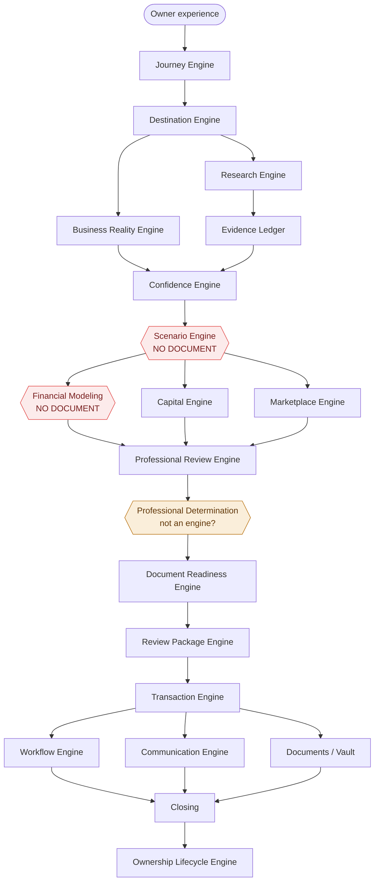
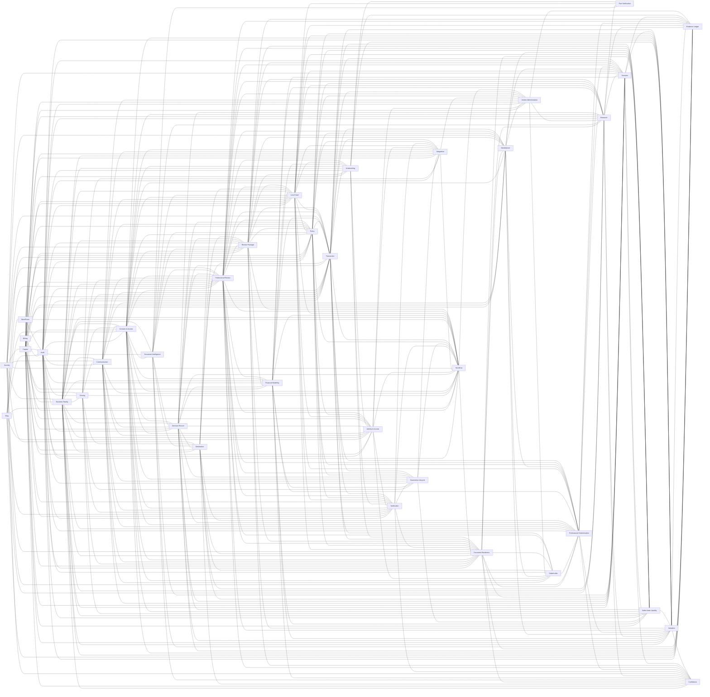

# End-to-end gap analysis

* generated: 2026-09-20 11:04:00 -0700

Generated by `scripts/doc-graph.py` — a dependency graph for the design
bible. Every `.md` file is a node; the edges come from the corpus's real
edge syntax (boundary tables, the section-20 flow diagram, the
infrastructure ring, and explicit links).

Superseded versions are kept in `analysis/archive/`. A `pre-commit`
hook regenerates this report, so it always describes the tree you are
committing.

## Corpus at a glance

* documents on disk: **58** (56 content + README + index)
* DOCUMENT-INDEX entries: **56**
* README group-table total: **56**
* engine keys in the declared architecture: **37**
* engine keys with a backing document: **37**
* cross-cutting properties, not engines: **1** — Security
* docs carrying a boundary table: **34**
* boundary edges extracted: **495**
* explicit markdown links between docs: **86**

---

## Findings

| # | Check | Count | Severity |
| --- | --- | --- | --- |
| 1 | Roster views that disagree with each other | 0 | High |
| 2 | README's prose roster disagreeing with the layers | 0 | High |
| 3 | Dangling engines — declared, no document | 0 | High |
| 4 | Documents claiming a built component is absent | 0 | High |
| 5 | Engine docs with no boundary section | 0 | High |
| 6 | Structural ambiguity | 0 | Medium |
| 7 | Boundaries with undeclared engines | 0 | Medium |
| 8 | Boundary in prose, not machine-readable | 0 | Medium |
| 9 | Engines no boundary table mentions | 0 | Medium |
| 10 | Naming drift | 0 | Low |
| 11 | Orphan documents | 0 | Low |
| 12 | Layer violations | 0 | Low |
| 13 | Coverage and count mismatches | 0 | Low |

## 1. Roster views that disagree with each other

None — ENGINE_HOME, LAYERS and LAYERLESS agree.

## 2. README's prose roster disagreeing with the declared layers

None — the README roster matches LAYERS and CROSS_CUTTING.

## 3. Dangling engines — declared in the architecture, no document

None — every declared engine resolves to a document.

## 4. Documents claiming a built component is absent

None — no document still presents a built component as missing.

## 5. Engine docs with no boundary section at all

None.

## 6. Structural ambiguity

None.

Multi-engine documents on record — decided, so not counted above:

* Expanded Reality Architecture - Document Intelligence and Fact Verification.md — Document Intelligence, Fact Verification: one pipeline in two halves: Document Intelligence extracts the facts, Fact Verification checks them against each other and against the stated reality. Split only if either engine ever gains a home document of its own.
* Goal-to-Reality Confidence Research Engine.md — Confidence, Evidence Ledger, Research: one specification in three parts: Research gathers, Evidence Ledger records provenance (section 12), Confidence scores. Split only if any of the three ever gains a home document of its own.

## 7. Boundaries with engines that are not declared anywhere

None — every boundary names a declared engine.

## 8. Boundary declared in prose only (not machine-readable)

None — every boundary is expressed as a table.

## 9. Engines that no boundary table anywhere mentions

None — every engine is named by at least one boundary table.

## 10. Naming drift — one engine, several names

None — engine names are used consistently.

## 11. Orphan documents

None — every document is referenced by at least one other.

## 12. Layer violations

None — every layer-organized group agrees with its declared layer.

## 13. Coverage and count mismatches

None — roster, README table, and disk all agree.

## 14. Cross-cutting properties — deliberately not engines

These names appear in the architecture but are properties every engine
must have, rather than components with their own boundary. They are
excluded from check 3 on purpose: the finding "this has no document"
was correct, and the answer was "it should not have one".

* **Security** — a property every engine must have, not a component with a boundary.
  * Where the responsibility actually lives: authentication, MFA, sessions, devices, reauthentication, high-risk changes, emergency suspension, service and AI identities, API credentials, separation of duties, tenant isolation -> Identity & Access; rules, gates, restrictions, credential expiry, fail-safe, emergency override -> Policy / Compliance; least privilege, purpose and time limitation, revocation, three-zone model -> Consent & Access; encryption at rest, integrity checks, privacy modes -> Local Vault; secrets management -> Integration section 73; forensics -> Audit / Provenance.
  * Out of scope: operational security -- vulnerability management, penetration testing, incident response, breach notification, security monitoring (SIEM), infrastructure hardening, threat modelling, SOC 2 / ISO 27001 -- is deliberately outside the engine model. It is platform infrastructure, not a decision layer.

## 15. Declared pipeline topology

Infrastructure ring (depends on by every engine above, declared separately in
section 20):

## 16. Declared boundary graph

